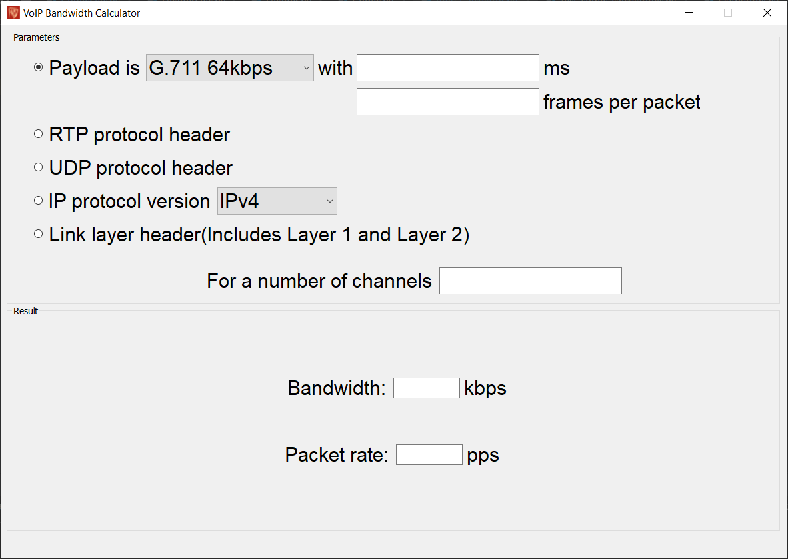
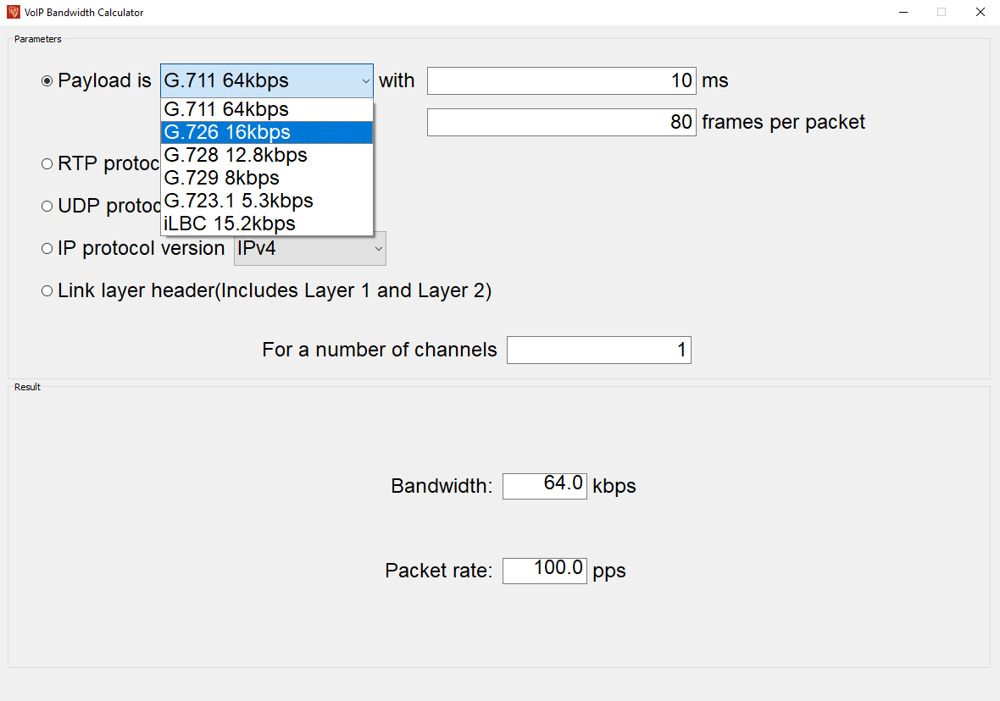
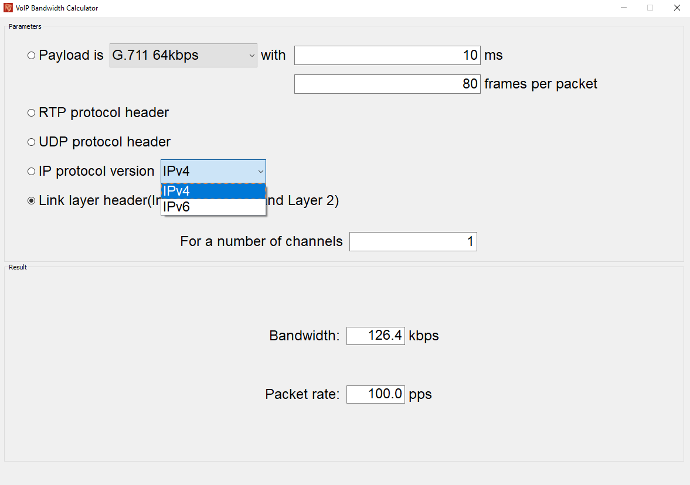
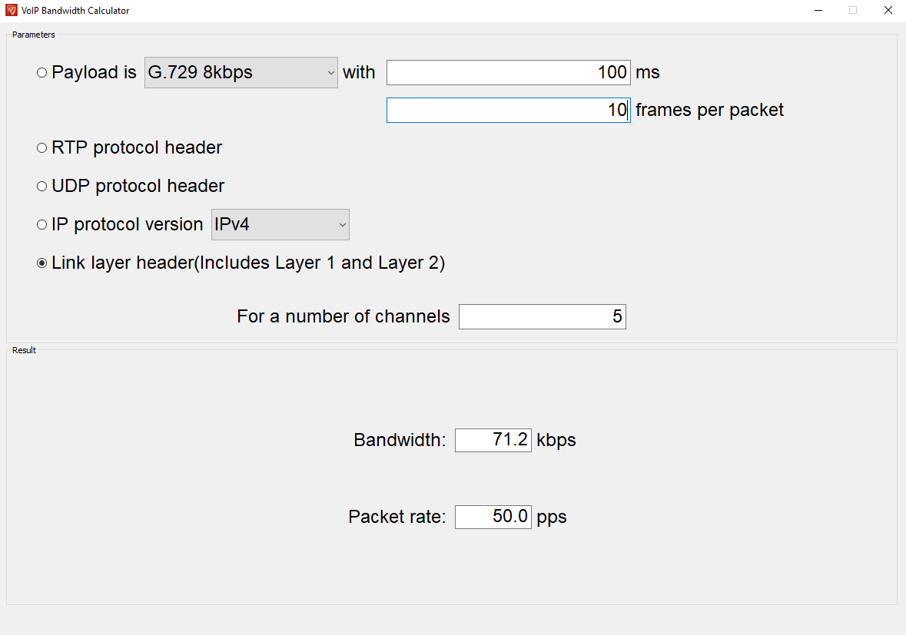

# VoIP Bandwidth Calculator

Rapid growth of computer networks led to an increase in the popularity of
internet telephony in the late 20th century. Today it is widely used by both large
companies and individual users. The use of modern IP telephony technologies
allows users to significantly reduce the cost of calls and integrate telephone services
with internet services, which causes problems with the dimensioning of network
resources needed to maintain a decent quality of services.

For such needs a calculator has been implemented. Based
on the key parameters of VoIP technology, it is intended to facilitate the calculation
of the necessary parameters for the implementation of a given service, such as:

1. Bandwidth
2. Packet rate

## Parameters
In the calculator you can specify following parameters described below to find needed bandwidth.

### Codecs
The size of the package strongly depends on the selected codec, and it plays important role in network 
dimensioning as it affects the required bandwidth.
The voice codecs used in VoIP are described by **ITU-T** and **IETF** recommendations and are listed in the
table below.

Standard | Codec | Bitrate | Frame Size |
:------------: | :------------: | :------------: | :------------: |
ITU-T     | G.711   | 64kbps    | 10ms  |
ITU-T     | G.726   | 16kbps    | 5ms   |
ITU-T     | G.728   | 12.8kbps  | 5ms |
ITU-T     | G.729   | 8kbps     | 10ms |
ITU-T     | G.723.1 | 5.3kbps   | 30ms  |
IETF      | iLBC    | 15.2kbps  | 20ms |

### Protocols
The stack of used protocols matters when calculating the bandwidth needed,
because each of them adds a header to the package for network communication. This process also known as encapsulation.

While VoIP requires the use of RTP and
UDP in the transport layer(they are the basis for data transmission
real-time), other layers may use different protocols, such as
IP or Ethernet.

So, for calculating the bandwidth necessary for transmission important is the possibility of
adapt and incorporate different protocols from the layers of the TCP / IP model. Table 
below describes all used protocols with their header sizes you can specify in calculations.

Protocol | Header |
:------------: | :------------: |
RTP             | 12 byte|
UDP             | 8 byte|
IPv4            | 20 byte|
IPv6            | 40 byte|
Ethernet 802.3  | 38 byte|

## Overview

VoIP calculator is a relatively simple application. It consists of one windows
divided into two sections, the first section is for setting parameters and the other one
is used to demonstrate the results.

Checkout other figures below, to get used to VoIP Calculator UI.

1. Selection of the codec and its parameters

2. Protocol stack selection with IP version selection

3. Number of channels

